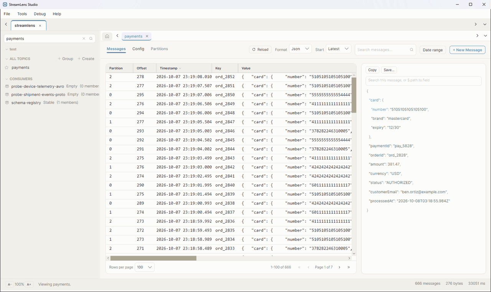
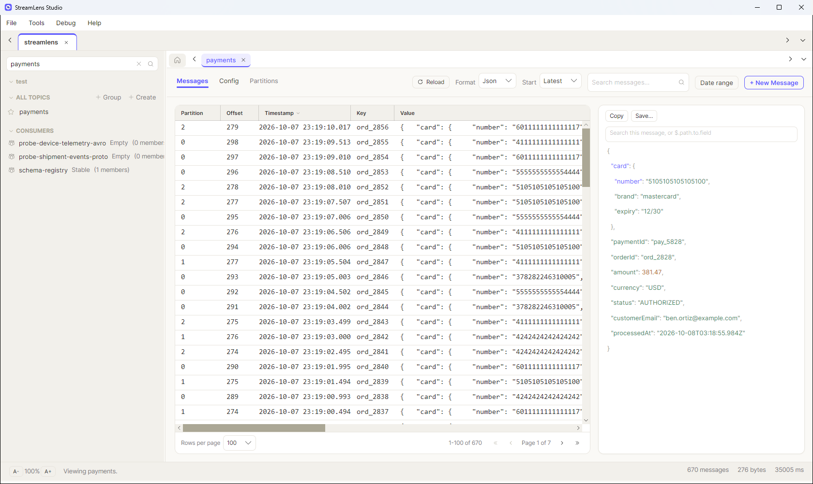
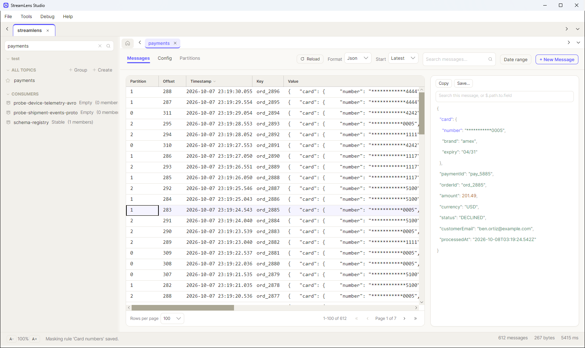
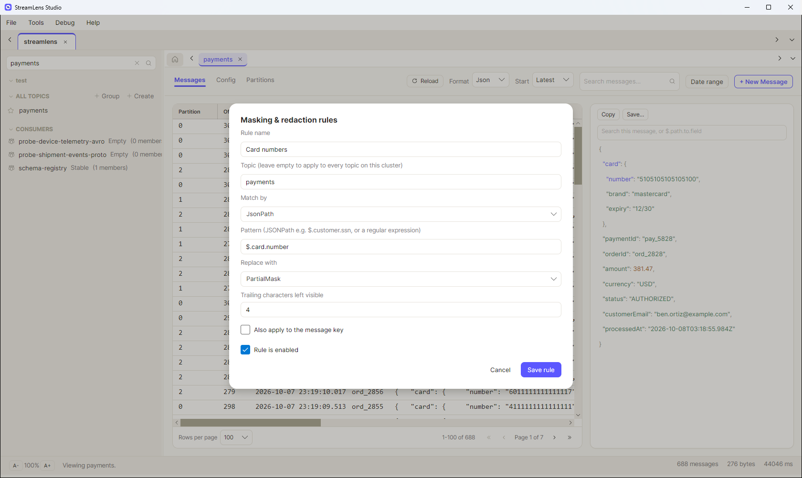

# StreamLens Studio

A native desktop client for Apache Kafka, for developers and platform engineers
who want to browse topics, tail and decode messages, and mask sensitive fields
without deploying a web UI.

[](#license)
[](https://github.com/getaxtools/StreamLens/releases)
[](https://github.com/getaxtools/StreamLens/releases)
[](#download)
[](#download)



*Live tail of a `payments` topic. Saving a masking rule on `$.card.number`
cuts every card number on screen down to its last four digits, in the message
list and the detail pane.*

> **Status: v0.8.0, pre-release.** Stable: cluster connections, topic browsing
> and live tail, decoding, search, publishing, masking, export, the audit log,
> diagnostics, bug reports and update checks. Not yet stable: the consumer
> groups view, including lag and offset moves. Windows only for now: Linux is
> expected in the first week of November 2026 and macOS in the first week of
> December 2026. We're also preparing to open-source StreamLens under GPL-3.0,
> so stay tuned for updates. There are real gaps, so read
> [Current limitations](#current-limitations) before you download.

---

## Download

**Windows:** [Download StreamLens.exe](https://github.com/getaxtools/StreamLens/releases/download/v0.8.0/StreamLens.exe).
It's a single self-contained file, about 75 MB. No installer, no account,
nothing to configure. Download it, run it, and add your first cluster
connection.

> Windows shows a SmartScreen warning on first run. The build is signed, but
> with a self-signed certificate rather than one from a certificate authority,
> so Windows has no way to vouch for it. Choose **More info → Run anyway** if
> you're happy to proceed. To confirm your download really is the file that
> was published, check its SHA-256 hash against the release notes. There's a
> walkthrough in [Verifying your download](docs/verification/README.md).

**Linux:** expected in the first week of November 2026. Until then there's no
Linux download.

**macOS:** work in progress, expected in the first week of December 2026.
Until then there's no macOS download.

All builds, including the first Linux and macOS ones, go on the
[Releases page](https://github.com/getaxtools/StreamLens/releases).
New here? The [user guide](docs/usage_guide.md) walks you through connecting
to a cluster and reading your first messages.

---

## Why StreamLens

Most Kafka UIs are web apps you have to deploy and maintain. The desktop
alternatives tend to be licensed per seat or built on aging Java toolkits.
StreamLens Studio is a desktop app that remembers how you work. It runs on
Windows today, with macOS and Linux builds on the way, and it's free to use,
including at work.

Three things it does that free desktop clients generally don't:

- **Masking rules applied before display or export.** Pattern or field-path
  rules redact sensitive values in the message list, the detail pane, and
  every export. If a pattern rule times out, the value is withheld rather
  than shown. A rule that fails to compile is skipped with a warning, so check
  the status bar after saving one. Treat this as display and export hygiene rather
  than a security boundary, because the full message still comes from the
  broker. What it does do is keep card numbers off a screen you're sharing.

  <table>
    <tr>
      <th>Without a rule</th>
      <th>With a rule on <code>$.card.number</code></th>
    </tr>
    <tr>
      <td></td>
      <td></td>
    </tr>
  </table>

  <details>
  <summary>The rule behind it</summary>

  A JsonPath rule scoped to the `payments` topic, replacing the value with a
  partial mask that leaves the last four characters visible.
  See [Masking and redaction](docs/masking-and-redaction.md) for every option.

  
  </details>

- **Production guardrails, with a log you can read.** Tag a cluster
  `Production` and destructive actions make you type the resource name to
  confirm. Every change is recorded to a local audit log covering
  connections, topic creates and deletes, offset moves, and messages
  published, and **Tools → Audit Log…** lets you filter and export it.
- **Per-topic settings that persist.** Format and start position are
  remembered per topic, so reopening one doesn't quietly reset it to raw bytes
  and start-from-beginning.

## How it compares

Each of these tools has strengths. The web UIs cover more of Kafka's admin
surface, and StreamLens is the only one here that's both free for commercial
use and needs nothing deployed. The table shows where StreamLens is behind as
well as where it's ahead.

✅ Yes  ·  🟡 Partly  ·  ❌ No  ·  ❔ Not documented

| | StreamLens Studio | [Kafka UI (Kafbat)](https://github.com/kafbat/kafka-ui) | [AKHQ](https://github.com/tchiotludo/akhq) | [Offset Explorer](https://www.kafkatool.com/) |
|---|---|---|---|---|
| **Getting started** | | | | |
| Free for commercial use | ✅ | ✅ | ✅ | ❌ Paid after a 30-day trial |
| Open source | 🟡 Planned, GPL-3.0 | ✅ Apache-2.0 | ✅ Apache-2.0 | ❌ Proprietary |
| Desktop app, nothing to deploy | ✅ | ❌ Server you host | ❌ Server you host | ✅ |
| Platforms | 🟡 Windows; Linux and macOS coming | ✅ Any browser | ✅ Any browser | ✅ Windows, macOS, Linux |
| **Connecting** | | | | |
| Multiple clusters | ✅ | ✅ | ✅ | ✅ |
| SASL, SSL and mutual TLS | ✅ | ✅ | ✅ | ✅ |
| Kerberos (GSSAPI) | 🟡 Configurable, not verified | ✅ | ❔ | ❔ |
| **Reading messages** | | | | |
| Live tail | ✅ | ✅ | ✅ | ❔ |
| JSON, pretty-printed | ✅ | ✅ | ✅ | ✅ |
| Avro via Schema Registry | ✅ | ✅ | ✅ | ✅ |
| Protobuf via Schema Registry | ✅ | ✅ | ✅ | ✅ |
| Protobuf without a registry | ❌ | ✅ `.proto` files | 🟡 Compiled descriptors | ❔ |
| Search the whole topic by field and time | ✅ | ✅ | 🟡 Text match only | ✅ |
| **Writing messages** | | | | |
| Produce messages | ✅ | ✅ | ✅ | ✅ |
| Produce Avro or Protobuf with registry framing | ❌ Sends plain text | ✅ | ✅ | ✅ |
| **Protecting data** | | | | |
| Field masking | ✅ Pattern and JSONPath | ✅ Remove, replace, mask | ✅ Regex and JSON fields | ❔ |
| Audit log | ✅ Local, with a viewer | ✅ Kafka topic or console | ✅ Kafka topic | ❔ |
| Production guardrails | ✅ Type the name to confirm | ✅ Read-only mode | ✅ Read-only role | ❔ |
| Export messages | ✅ CSV, JSON, zip | ✅ CSV, JSON | 🟡 JSON only | 🟡 Raw binary |
| **Operating the cluster** | | | | |
| Consumer groups with lag | 🟡 Not yet stable | ✅ | ✅ | ✅ |
| Reset offsets to earliest, latest or a time | 🟡 One topic at a time, not yet stable | ✅ | ✅ | 🟡 Specific offsets only |
| Kafka Connect | ❌ | ✅ | ✅ | ✅ |
| ksqlDB | ❌ | ✅ | ✅ | ✅ |
| ACL management | ❌ | ✅ | 🟡 View only | ✅ |
| Logins and roles for teams | ❌ Single user | ✅ | ✅ | ❔ |

Checked against each project's own docs and source in October 2026.
❔ means we couldn't find it documented, not that it's missing. Spot something
wrong? Please [open an issue](https://github.com/getaxtools/StreamLens/issues).
Conduktor Desktop isn't listed because it has reached end of life, and
existing installs can no longer sign in. Conduktor now offers the web-based
Conduktor Console instead.

## Features

| Area | What you get |
|---|---|
| **Clusters** | Multiple saved connections, SASL/SSL, connection test, import/export. Passwords are encrypted with Windows DPAPI, never stored in the app's database. |
| **Topics** | Live tail across all partitions, topic filter, favorites, groups, config and per-partition views with under-replication flagged |
| **Decoding** | String, JSON with pretty-printing, and Avro and Protobuf via Confluent Schema Registry |
| **Search** | Text scan, field paths (`$.order.id`), and timestamp ranges, searched across the whole topic rather than just what's loaded |
| **Producing** | Compose a message with key, value, headers, and target partition, or edit and republish an existing one. Values are sent as plain text, and a JSON value is checked against the topic's registered Avro schema before it's sent. |
| **Masking** | Pattern and field-path redaction rules, applied everywhere the value is shown or exported |
| **Export** | CSV, JSON, and a zip of per-message JSON files, with spreadsheet formula-injection escaping |
| **Brokers & groups** | Broker list, plus consumer groups with state, members, per-partition lag, and offset editing |
| **Offsets** | Move a group per partition, send every partition to the start or the end, or reset the whole topic to earliest, latest, or a timestamp |
| **Audit log** | A viewer for every write and destructive action, filterable by cluster, action, or text, with CSV export |
| **Diagnostics** | An Output panel showing each connection step and refresh as it happens, with timings, so a slow step doesn't look like a hang |
| **Bug reports** | Crashes and failed connections write a report you can file as a pre-filled GitHub issue, after a preview showing exactly what it contains |
| **Updates** | Tells you when a new version is out and links straight to the download. Checks once a day, sends nothing about you, and stays quiet when you're offline |

## Current limitations

Being upfront so you don't waste a download:

- **Windows only for now.** The Linux build is expected in the first week of
  November 2026, and the macOS build in the first week of December 2026. See
  the [roadmap](#roadmap).
- **No Kafka Connect, ksqlDB, or ACL management.**
- **Publishing doesn't encode Avro or Protobuf.** The app sends the value as
  plain UTF-8 text, without the Confluent framing (magic byte and schema ID).
  Anything you publish to an Avro or Protobuf topic can't be read by consumers
  that use the registered schema, so use your own producer for those topics.
- **Protobuf needs a Schema Registry.** A payload with no registered schema
  can't be decoded, since there's no schemaless fallback.
- **Offsets move one topic at a time**, and only while the group has no
  running members. Kafka refuses it otherwise, so the app refuses first.
- **Kerberos (GSSAPI) is configurable but not verified end to end.** The
  broker setup has been tested against a test KDC with a Linux Kafka client.
  On Windows the app uses SSPI, which needs a domain-joined machine and an
  Active Directory service principal, and we haven't tested that. Keytabs
  don't work on Windows at all, since the underlying client uses your
  logged-on account. Kerberos on macOS and Linux will be tested when those
  builds ship.
- **Single user.** No logins or roles of its own, so your operating-system
  account is the access boundary.

## Roadmap

The roadmap isn't fixed, and what people report shapes the order things get
built in. Most-wanted first:

- **Linux and macOS builds.** Linux is expected in the first week of November
  2026, and macOS in the first week of December 2026. The UI toolkit is
  cross-platform already, so the work is in the platform-specific pieces,
  mainly the secret store and packaging.
- **Protobuf from a local `.proto` file**, for topics with no Schema Registry.
  Registry-backed decoding works today.
- **Verifying Kerberos on Windows** against a domain-joined machine and a real
  Active Directory service principal.
- **Moving offsets for more than one topic at a time**, the next step now
  that the per-topic case is in.

Think the order is wrong, or want something that isn't listed? Make the case
in an [issue](https://github.com/getaxtools/StreamLens/issues) or in
[Discussions](https://github.com/getaxtools/StreamLens/discussions). At this
stage a single well-argued request can change the order.

## Where your data lives

Everything is local. No account, no cloud service, no telemetry.

The one exception is the update check. Once a day StreamLens asks GitHub what
the latest released version is. It sends nothing about you, your machine, or
your clusters, and it does nothing at all when you're offline. There's more
detail in
[Keeping StreamLens up to date](docs/usage_guide.md#11-keeping-streamlens-up-to-date).

```
%LocalAppData%\StreamLensStudio\
  streamlens.db       # connections, settings, per-topic preferences, audit log
  secrets\            # your cluster passwords, encrypted by Windows
  diagnostic.log      # local troubleshooting log
  crashes\            # crash reports, if the app has ever hit one
  update-check.json   # when updates were last checked for, and any version you dismissed
  window-layout.json  # window chrome that survives a restart, such as the sidebar width
```

Once they ship, the macOS and Linux builds will keep the same files in
`~/Library/Application Support/StreamLensStudio/` and
`~/.local/share/StreamLensStudio/`. The macOS build will keep cluster
passwords in the Keychain instead of `secrets/`.

Kafka messages are **never** written to disk. They stream from the broker and
are held in memory only, capped at 5,000 messages per topic view.

`diagnostic.log` is plain text, and it records previews of message content
along with the addresses of clusters you connect to (never passwords). Read
[Your data and security](docs/usage_guide.md#9-your-data-and-security) before
you attach it to a bug report. The same goes for a crash report, which is why
the app shows you one in full before it goes anywhere.

## Community and support

- **Bugs:** open a [GitHub issue](https://github.com/getaxtools/StreamLens/issues).
  Include what you were doing, what you expected, and what actually happened,
  plus the StreamLens version and your OS. If it's a connection problem, your
  Kafka setup helps too: managed service or self-hosted, and which security
  protocol.
- **Questions and ideas:** use
  [GitHub Discussions](https://github.com/getaxtools/StreamLens/discussions).
- **From inside the app:** after a crash or a failed connection, the
  **Report this** button does most of the work. It shows you the full report,
  puts it on your clipboard, and opens a pre-filled issue. Nothing leaves your
  machine until you've read it and chosen to send it.

## Documentation

The full index is in [docs/](docs/README.md).

**Using the app**

- [User guide](docs/usage_guide.md) covers connecting, reading messages,
  searching, publishing, exporting, and what the app stores on your machine
- [Masking and redaction](docs/masking-and-redaction.md) explains
  how to write and test redaction rules
- [Verifying your download](docs/verification/README.md) walks through
  checking the SHA-256 hash, and what the code signature does and doesn't
  prove

**Trying it against a local Kafka**

- [Local Kafka sandbox](docker/README.md) starts a disposable cluster with
  seeded topics: plaintext, TLS/SASL, and Kerberos stacks
- [Testing connection types](docs/testing/connections.md) has step-by-step
  setup for plaintext, mutual TLS, SASL/SCRAM, and an authenticated Schema
  Registry
- [Testing Avro](docs/testing/avro.md) covers schema evolution, logical types,
  and malformed payloads

## License

StreamLens Studio is free to use, including commercially, on as many machines
as you like. No seat limits, no registration, no trial period. Full terms are
in [LICENSE](LICENSE).

We're preparing to release the source code under the GNU General Public
License v3.0. Stay tuned for updates: watch this repository or check the
[Releases page](https://github.com/getaxtools/StreamLens/releases).

StreamLens Studio bundles third-party open-source components, and their
licenses are reproduced in [THIRD-PARTY-NOTICES.md](THIRD-PARTY-NOTICES.md).
